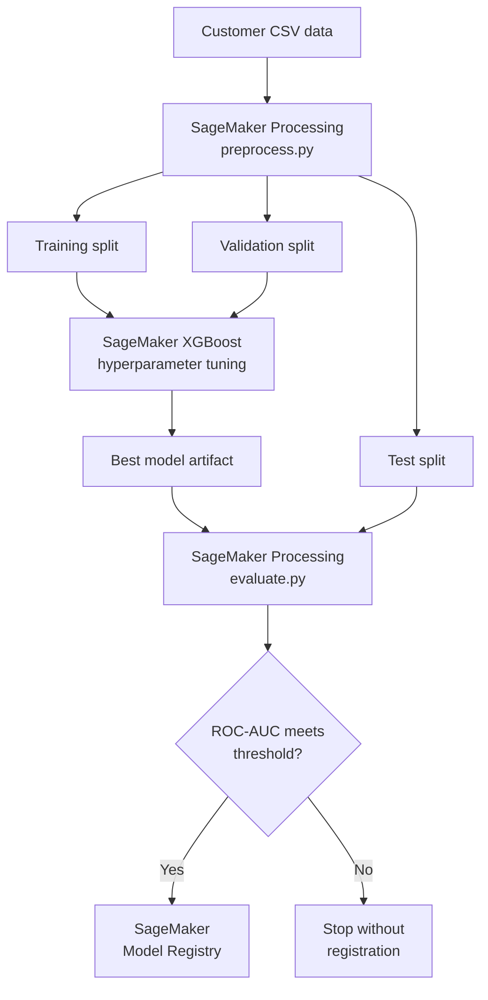

# Customer Churn Prediction with Amazon SageMaker

An end-to-end machine learning project that explores customer data, trains and tunes an XGBoost churn classifier, evaluates its performance, and automates the workflow with Amazon SageMaker Pipelines.

The project demonstrates how a notebook-based machine learning experiment can be converted into a repeatable, traceable, and production-oriented AWS workflow. It includes data exploration, preprocessing, hyperparameter tuning, model evaluation, conditional model registration, visual reports, and pipeline execution artifacts.

## Project objective

Customer churn occurs when a customer stops using a company's service. Identifying customers who are likely to churn allows a business to intervene with retention offers, service improvements, or targeted communication.

The main goals of this project were to:

- Explore the customer dataset and identify patterns associated with churn.
- Prepare raw customer data for machine learning.
- Train an XGBoost binary classification model.
- Optimize the model through SageMaker hyperparameter tuning.
- Evaluate the selected model using classification metrics and visual diagnostics.
- Build a reusable SageMaker Pipeline for preprocessing, tuning, evaluation, quality checking, and model registration.
- Register the model only when it meets the required ROC-AUC threshold.
- Generate reports that make the final results easier to interpret and present.

## Final outcome

The completed SageMaker Pipeline ran successfully from preprocessing through model registration:

| Pipeline step | Purpose | Final status |
|---|---|---|
| `PreprocessChurnData` | Clean, transform, and split the source data | Succeeded |
| `TuneChurnXGBoost` | Run XGBoost hyperparameter tuning | Succeeded |
| `EvaluateBestTunedModel` | Evaluate the best model from the tuning job | Succeeded |
| `CheckChurnAUC` | Compare the evaluation AUC with the quality threshold | Succeeded — condition was `True` |
| `RegisterChurnModel-RegisterModel` | Add the qualified model to the Model Registry | Succeeded |

The registered model became version `1` in the `UMassChurnModelPackageGroup` SageMaker Model Registry group.

One of the best hyperparameter-tuning trials produced an objective value of approximately `0.98374`, using:

| Hyperparameter | Value |
|---|---:|
| `alpha` | 2.46521 |
| `colsample_bytree` | 0.794429 |
| `eta` | 0.059729 |
| `lambda` | 1.130447 |
| `max_depth` | 6 |
| `min_child_weight` | 1.060275 |
| `subsample` | 0.701082 |

The successful AUC condition confirmed that the selected model met the minimum model-quality requirement configured in the pipeline. The project therefore achieved its primary objective: producing a tuned, evaluated, reproducible, and registered churn prediction model.

> The model is registered but is not automatically deployed as a real-time endpoint. Deployment should be treated as a separate controlled step after model review and approval.

## Solution architecture



Amazon S3 stores pipeline inputs and generated artifacts, including processed datasets, model archives, and evaluation output. SageMaker Pipelines connects the individual jobs and records their execution lineage.

## Project workflow

### 1. Data collection and validation

The source customer dataset is stored in:

```text
data/storedata_total.csv
```

The data was originally handled as a spreadsheet and converted to CSV so that it could be consumed consistently by pandas and SageMaker processing jobs.

Initial checks included:

- Dataset dimensions and column names
- Data types
- Missing values
- Duplicate records
- Target-label distribution
- Numerical and categorical feature distributions
- Potential data-quality and class-imbalance concerns

### 2. Exploratory data analysis

`notebooks/01_churn_exploration.ipynb` contains the exploratory and experimental phase of the project. It examines the relationship between customer attributes and the churn target and prepares the first model-training experiments.

The notebook is also used to:

- Load and inspect the dataset
- Explore class balance
- Prepare features and labels
- Upload required data to Amazon S3
- Configure the SageMaker execution environment
- Train an initial XGBoost model
- Launch hyperparameter tuning
- inspect and compare tuning-job results

### 3. Data preprocessing

`src/preprocess.py` is the reusable preprocessing program executed by a SageMaker Processing job.

Its role is to:

- Read the raw CSV input supplied to the processing container
- Clean and transform the data
- Prepare model-compatible numerical features
- Separate the target from the predictors
- Split the processed records into training, validation, and test datasets
- Write each output to the SageMaker processing directories that are uploaded to S3

Keeping preprocessing in a standalone script makes the transformation repeatable and prevents the production pipeline from depending on interactive notebook state.

### 4. Model training

The project uses the AWS-provided SageMaker XGBoost algorithm for binary classification. XGBoost was selected because it:

- Performs well on structured/tabular data
- Captures nonlinear relationships and feature interactions
- Includes regularization controls
- Supports scalable managed training in SageMaker
- Integrates directly with SageMaker hyperparameter tuning and Pipelines

### 5. Hyperparameter tuning

The tuning step launches multiple training jobs with different parameter combinations. SageMaker compares the trials using the configured objective metric and identifies the best-performing model.

Parameters explored include:

- Learning rate (`eta`)
- Maximum tree depth
- Minimum child weight
- Row subsampling
- Column subsampling
- L1 regularization (`alpha`)
- L2 regularization (`lambda`)

Multiple training jobs are expected during this step: each job represents a different candidate configuration. The best completed training job supplies the model artifact used by the evaluation step.

### 6. Model evaluation

`src/evaluate.py` runs as a separate SageMaker Processing job. It loads the best tuned `model.tar.gz`, scores the test data, calculates evaluation metrics, and writes a machine-readable `evaluation.json` file.

The repository includes the following evaluation outputs:

- Confusion matrix
- ROC curve
- Precision-recall curve
- SHAP feature-importance summary
- Tuning-results table
- Pipeline graph

ROC-AUC is used by the pipeline as its registration gate because it measures the model's ability to rank churners above non-churners across classification thresholds. The confusion matrix, precision, recall, and precision-recall curve remain important because the operational cost of missed churners and unnecessary retention interventions may be different.

### 7. Automated SageMaker Pipeline

`notebooks/02_create_pipeline.ipynb` converts the experimental workflow into a parameterized SageMaker Pipeline.

The notebook defines:

1. Pipeline session, IAM role, AWS Region, S3 locations, and runtime parameters
2. A preprocessing step using `src/preprocess.py`
3. An XGBoost estimator and hyperparameter tuner
4. A tuning step that consumes the processed training and validation data
5. An evaluation step using `src/evaluate.py`
6. A property file that exposes metrics from `evaluation.json`
7. An AUC condition step
8. A model registration step for models that pass the threshold
9. Pipeline creation or update and pipeline execution

The condition prevents an underperforming model from being registered. In the completed run, the condition outcome was `True`, so the registration branch executed successfully.

### 8. Reporting

`notebooks/03_generate_reports.ipynb` converts model and pipeline outputs into presentation-ready tables and charts. The generated files are stored under `reports/`.

These artifacts provide both technical and business-facing evidence of model performance and pipeline completion.

## Repository structure

```text
customer-churn-sagemaker/
├── .gitignore
├── README.md
├── requirements.txt
├── data/
│   └── storedata_total.csv
├── docs/
├── notebooks/
│   ├── 01_churn_exploration.ipynb
│   ├── 02_create_pipeline.ipynb
│   ├── 03_generate_reports.ipynb
│   └── model.tar.gz
├── reports/
│   ├── confusion-matrix.png
│   ├── evaluation.json
│   ├── pipeline-graph.png
│   ├── precision-recall-curve.png
│   ├── roc-curve.png
│   ├── shap-summary.png
│   └── tuning-results.csv
└── src/
    ├── evaluate.py
    └── preprocess.py
```

The local working directory may also contain `.ipynb_checkpoints/` folders and Python `__pycache__/` files. These are automatically generated development artifacts and should normally be excluded from Git by `.gitignore`.

## File and folder reference

### Root files

| Path | Description |
|---|---|
| `.gitignore` | Prevents notebook checkpoints, Python caches, virtual environments, credentials, logs, and temporary files from being committed. |
| `README.md` | Project overview, implementation guide, results, and repository documentation. |
| `requirements.txt` | Python package dependencies required by the notebooks and local scripts. |

### Data

| Path | Description |
|---|---|
| `data/storedata_total.csv` | Source customer dataset used for exploration, preprocessing, training, and evaluation. |
| `data/.ipynb_checkpoints/` | Automatically generated Jupyter checkpoint directory; it is not a source-data component. |

### Notebooks

| Path | Description |
|---|---|
| `notebooks/01_churn_exploration.ipynb` | Performs data exploration, experimental model development, SageMaker training, hyperparameter tuning, and tuning-result review. |
| `notebooks/02_create_pipeline.ipynb` | Defines and runs the end-to-end SageMaker Pipeline, including preprocessing, tuning, evaluation, AUC validation, and conditional model registration. |
| `notebooks/03_generate_reports.ipynb` | Generates the final evaluation tables, plots, explainability output, and pipeline reports. |
| `notebooks/model.tar.gz` | Local copy of an XGBoost model artifact produced by SageMaker and used for evaluation or report generation. |
| `notebooks/.ipynb_checkpoints/` | Jupyter autosave checkpoints; not part of the intended project source. |

### Source code

| Path | Description |
|---|---|
| `src/preprocess.py` | Standalone SageMaker Processing script that reads the raw data, transforms it, splits it, and saves training, validation, and test outputs. |
| `src/evaluate.py` | Standalone evaluation script that loads the selected model, generates test predictions, calculates metrics, and saves evaluation output. |
| `src/__pycache__/preprocess.cpython-312.pyc` | Python 3.12 bytecode generated automatically after importing or executing `preprocess.py`; it is not editable source code. |
| `src/.ipynb_checkpoints/` | Jupyter-generated checkpoints for files edited through JupyterLab. |

### Reports

| Path | Description |
|---|---|
| `reports/evaluation.json` | Machine-readable evaluation metrics consumed by the condition step and reporting workflow. |
| `reports/confusion-matrix.png` | Visualization of correct and incorrect predictions by class. |
| `reports/roc-curve.png` | Plots true-positive rate against false-positive rate across thresholds. |
| `reports/precision-recall-curve.png` | Shows the trade-off between precision and recall, especially useful when churn classes are imbalanced. |
| `reports/shap-summary.png` | Summarizes how features influence model predictions using SHAP values. |
| `reports/tuning-results.csv` | Tabular comparison of SageMaker hyperparameter-tuning trials and their objective values. |
| `reports/pipeline-graph.png` | Visual representation of the SageMaker Pipeline and its step dependencies. |

### Other directories

| Path | Description |
|---|---|
| `docs/` | Reserved for supporting project documentation. Git does not retain an empty directory unless it contains a placeholder file such as `.gitkeep`. |
| `.git/` | Local Git metadata and commit history. It is managed by Git and is never uploaded as a normal repository folder. |
| `.ipynb_checkpoints/` | Root-level Jupyter autosave data; normally ignored. |

## Prerequisites

To reproduce the AWS workflow, you need:

- An AWS account
- Amazon SageMaker Studio or SageMaker JupyterLab access
- An IAM execution role with appropriate SageMaker, S3, ECR, CloudWatch, and Model Registry permissions
- An S3 bucket available to the SageMaker execution role
- Python 3.12 or a compatible Python environment
- Git, if cloning or contributing to the repository

AWS resources incur charges. Processing jobs, training jobs, tuning trials, Studio applications, stored S3 objects, and deployed endpoints should be stopped or removed when they are no longer needed.

## Installation

Clone the repository:

```bash
git clone https://github.com/vsolanki76771215/customer-churn-sagemaker.git
cd customer-churn-sagemaker
```

Create and activate a virtual environment:

```bash
python -m venv .venv
source .venv/bin/activate
```

On Windows PowerShell:

```powershell
python -m venv .venv
.\.venv\Scripts\Activate.ps1
```

Install the dependencies:

```bash
python -m pip install --upgrade pip
pip install -r requirements.txt
```

## Recommended execution order

Open the project in SageMaker JupyterLab and run:

1. `notebooks/01_churn_exploration.ipynb`
2. `notebooks/02_create_pipeline.ipynb`
3. `notebooks/03_generate_reports.ipynb`

Before running the notebooks:

- Confirm that `data/storedata_total.csv` exists.
- Confirm that the SageMaker execution role is available.
- Review the AWS Region, S3 bucket or prefix, instance types, and pipeline name.
- Confirm that the script paths point to `src/preprocess.py` and `src/evaluate.py`.
- Avoid hard-coding AWS credentials. Use the SageMaker execution role.

Notebook cells should be run in order because later cells depend on variables and AWS resources created by earlier cells.

## Pipeline parameters

The exact names are defined in `02_create_pipeline.ipynb`, but the pipeline is designed around configurable values such as:

- Input dataset S3 location
- Processing instance type and count
- Training instance type
- AUC quality threshold
- Model approval status
- Model package group name

Parameterization makes it possible to rerun the same pipeline with a new dataset or resource configuration without rebuilding its logic.

## Interpreting the outputs

### Tuning objective

The tuning objective indicates how well each candidate model performed against the selected validation metric. The highest-ranked completed job becomes the input to evaluation. A strong tuning score alone is not sufficient; performance must also be confirmed on held-out test data.

### Confusion matrix

The confusion matrix separates:

- True negatives: customers correctly predicted to remain
- False positives: customers incorrectly predicted to churn
- False negatives: churners that the model failed to identify
- True positives: churners correctly identified

In a retention use case, false negatives may be especially costly because the business receives no warning before those customers leave.

### ROC and precision-recall curves

The ROC curve evaluates ranking performance across thresholds. The precision-recall curve gives additional insight when the churn class is less common than the non-churn class.

The operating threshold should ultimately be chosen according to business costs, retention capacity, and the value of successfully retaining a customer.

### SHAP summary

The SHAP summary helps explain which variables have the greatest influence on the model and whether high or low feature values tend to increase predicted churn risk. SHAP supports interpretation but does not by itself prove that a feature causes churn.

## Reproducibility and design decisions

Several implementation choices improve reproducibility:

- Preprocessing and evaluation are stored in standalone Python scripts.
- Raw, processed, model, and evaluation artifacts are passed through defined S3 locations.
- Pipeline dependencies are expressed using step properties instead of notebook-only variables.
- Model evaluation is performed on a held-out test dataset.
- A property file exposes evaluation metrics to the pipeline.
- Model registration is controlled by an explicit quality condition.
- Tuning results and visual reports are retained for review.
- SageMaker records job metadata, logs, artifacts, and pipeline lineage.

## Limitations and next steps

The project demonstrates a complete training and registration workflow, but additional work would be required for a production deployment:

- Review the registered model and change its approval status according to governance policy.
- Deploy the approved model to a real-time endpoint or use SageMaker Batch Transform.
- Select a classification threshold based on business costs rather than relying only on the default threshold.
- Add automated data-quality and model-quality checks.
- Add drift detection with SageMaker Model Monitor.
- Add unit and integration tests for preprocessing and evaluation.
- Add CI/CD for pipeline updates.
- Protect sensitive customer data with encryption, access controls, and a private repository.
- Evaluate fairness across relevant customer segments.
- Track retention outcomes and periodically retrain the model with newer data.
- Remove endpoints and other billable resources when testing is complete.

## AWS artifacts not stored directly in Git

This repository contains the code, notebooks, local data, and selected reports. The following remain managed in AWS unless explicitly exported:

- S3 objects created by processing, tuning, and evaluation jobs
- SageMaker Pipeline definitions and execution history
- Training and hyperparameter-tuning job metadata
- CloudWatch logs
- SageMaker Model Registry versions
- IAM roles and policies
- Deployed endpoints and endpoint configurations

Keeping large or frequently changing training artifacts in S3 avoids GitHub file-size limits and keeps the repository focused on reproducible source material.

## Security notes

- Never commit AWS access keys, secret keys, session tokens, GitHub tokens, passwords, or private key files.
- Use a SageMaker execution role for AWS access.
- Keep the GitHub repository private if the dataset contains non-public or customer information.
- Review notebook outputs before committing because outputs can contain S3 paths, account identifiers, logs, or sample customer records.
- Rotate any credential immediately if it is accidentally committed.

## Author

**Vipul Solanki**  
UMass Global Machine Learning and Artificial Intelligence project

## Acknowledgments

This project was developed as an end-to-end Amazon SageMaker learning exercise and was informed by AWS guidance for building, tuning, evaluating, and registering a customer churn model with SageMaker Pipelines.

